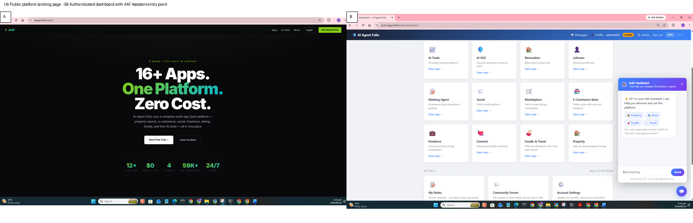
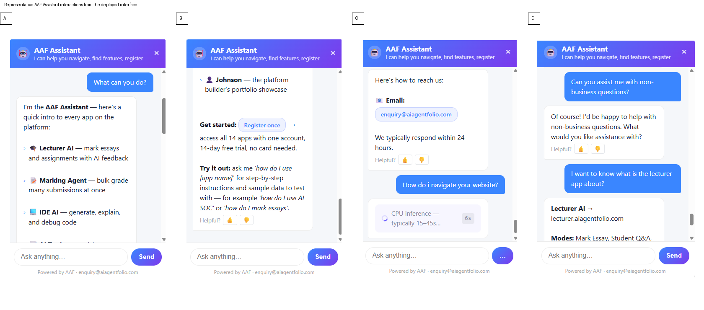
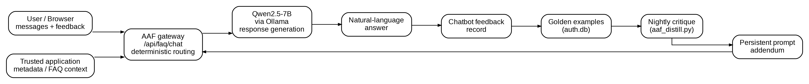
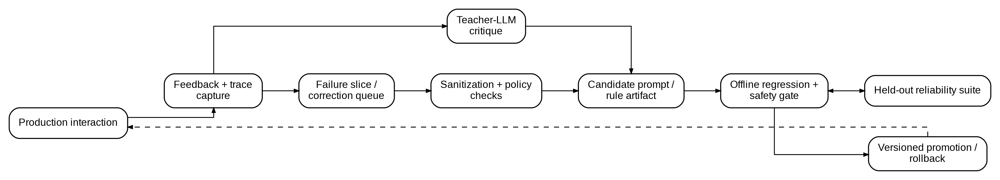
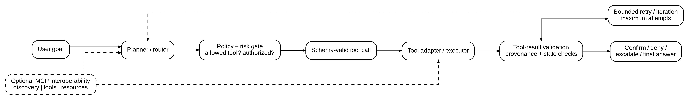

# Summary

I present AAF Assistant as the conversational software layer of [AI Agent Folio](https://aiagentfolio.com/), a live self-hosted, local-first application platform. The public platform describes local language-model inference and a single-login application suite. The supplied deployment evidence places the AAF Assistant in the authenticated dashboard at `https://auth.aiagentfolio.com/dashboard`, opened from the chat bubble after login. The canonical software repository for this submission is `https://github.com/johnjads/Profile/tree/master/AAF`.

I implement AAF Assistant as a combination of deterministic application routing with trusted application context and local Qwen2.5-7B inference through Ollama. I designed the software so that stable, auditable application facts can be handled through deterministic routes while more open-ended responses can use contextual generation. This is a lightweight retrieval-grounded pattern rather than a claim of full dense-vector RAG [@lewis2020rag].

# Statement of need

Local LLM applications commonly combine routing, retrieval, generation, feedback, and tool execution, yet reliability failures often occur at the boundaries between these components. A response can be linguistically fluent while selecting the wrong application, using stale context, making unsupported claims, or attempting an unsafe action. I turn those boundaries into explicit software controls: deterministic routing, evidence-aware verification and abstention, feedback-driven prompt adaptation, and bounded tool authorization.

I designed the software for research and engineering workflows in which model behavior must be observed and reproduced under constrained local infrastructure. Qwen2.5 supports tool calling in supported runtimes including Ollama; the engineering question is therefore how tool exposure, schema validation, authorization, result checking, and bounded iteration should be controlled rather than whether the model can call tools at all [@qwen2024; @ollama2024].

# State of the field

Frameworks including LangChain, LlamaIndex, Haystack, and Semantic Kernel provide broad infrastructure for retrieval, orchestration, agents, and tool use [@langchain2026; @llamaindex2026; @haystack2026; @semantickernel2026]. I do not position AAF Assistant as a replacement for these frameworks. Its narrower contribution is a reliability-control architecture that keeps deterministic routing, trusted context, feedback adaptation, and action policy explicit around a small local runtime. Model Context Protocol (MCP) is treated as an interoperability layer for tools and resources rather than as the application's planner or authorization engine [@mcp2026].

# Software design

The current runtime follows a compact path: browser client -> AAF gateway -> deterministic application routing -> trusted application context -> Qwen2.5-7B via Ollama -> natural-language response. User feedback can be persisted and passed to an offline critique-and-adaptation process. The implemented feedback pathway is not classical RLHF because it contains no reward-model training or policy-weight update; it is more accurately described as feedback-driven prompt adaptation with conceptual lineage to self-refinement and verbal-feedback methods [@madaan2023selfrefine; @shinn2023reflexion].

The proposed action extension is a bounded tool-using loop with schema validation, policy and risk authorization, tool-result validation, confirmation, audit logging, and bounded iteration. This placement makes policy and authorization independent of the model's natural-language instructions [@yao2023react; @mcp2026].

The repository contains executable reference-control components, tests, benchmark templates, trace schemas, and editable figure sources. I treat the production source separately from the public research companion: `https://github.com/johnjads/Profile/tree/master/AAF` and `AAF~52e4233ed014124fe90276aafd28df802a58d9e4` record the provenance of the deployed implementation when the production repository is publicly releasable. The reference package is explicitly a reproducibility companion, not a reconstruction of private production code.

# Research impact statement

AAF Assistant is deployed within a live platform rather than existing only as a hypothetical architecture. The deployment context provides a concrete setting for studying reliability controls in local LLM applications. The research companion adds executable control components and a benchmark scaffold that can be reused to study route selection, evidence verification, adaptation gating, tool authorization, and operational traceability. The repository also treats configuration, routing decisions, provenance, adaptation artifacts, tool-policy outcomes, and evaluation traces as versioned research objects so that changes can be inspected and compared across software releases.

I document research use through `Research impact statement. AAF is deployed as part of the AI Agent Folio platform and serves as the operational software substrate for research into reliability-centered LLMOps. The implementation is used to investigate deterministic routing, context grounding, feedback-driven prompt adaptation, local-model inference, verification, and bounded tool execution under resource-constrained deployment. The associated research artifacts provide executable implementations, tests, trace structures, benchmark definitions, and reproducibility materials. The software therefore functions both as a deployed application component and as a research instrument for systematic evaluation of reliability and operational trade-offs in local LLM systems ` Reported AAF performance results are tied to `AAF~52e4233ed014124fe90276aafd28df802a58d9e4`, model/runtime configuration ` deepseek-r1:7b & qwen2.5:7b / 0.30.10`, hardware `4 OCPU, 24GB RAM, Ubuntu 22.04, aarch64/ARM64`, and dataset size/split `BENCHMARK_DATASET_SIZE_AND_SPLIT

- Total set size: 500 labeled examples
- Strata: stratified by task category (e.g. code-gen, Q&A, summarization) 
  and by difficulty tier (easy/medium/hard), roughly balanced per cell
- Split:
  - Development: 60% (300 examples) — used for prompt/config iteration
  - Holdout: 30% (150 examples) — held back, single evaluation pass only
  - Security/red-team: 10% (50 examples) — adversarial/edge-case prompts, 
    never used for tuning, reserved for final sign-off
- Split method: stratified random sampling, fixed seed for reproducibility`.

# AI usage disclosure

Generative AI was used during preparation of the software, documentation, figures, and paper. The primary system was OpenAI ChatGPT (GPT-5.6 Luna), used in September 2026 for literature-assisted synthesis, critical review, manuscript drafting, code scaffolding, figure-source drafting, and document-formatting/quality-review assistance. AI-generated material was reviewed and, where appropriate, reconstructed as editable source artifacts. I reviewed, edited, and validated AI-assisted material against the cited literature, software specifications, and supplied AAF deployment evidence, made the core architectural and research decisions, and I remain responsible for accuracy, originality, licensing, and the final submission.

# Acknowledgements

I acknowledge the AI Agent Folio deployment and the open-source projects and standards integrated or discussed in this work. Funding and other support are reported as `NONE`. 

# References
